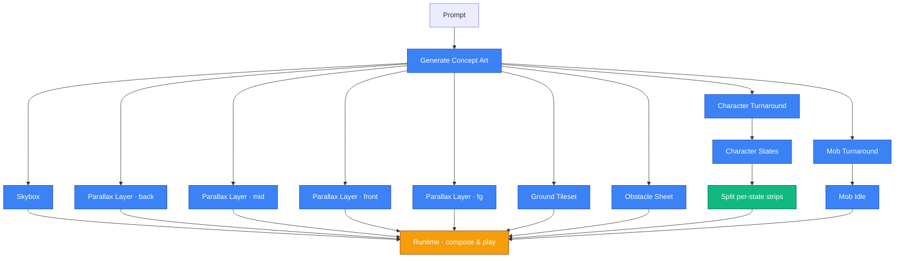

# stage-gen

Prompt-to-playable 2D side-scroller. One natural-language description in →
a parallax world, a character, an enemy, props, and a runnable demo out.

The system is a directed asset pipeline: a small set of **hand-authored
templates** constrains generation, the model fills in the painted detail,
and a **deterministic post-pipeline** stitches everything into a tileable,
loopable, playable scene.

---

## Pipeline at a glance



Stages run in three waves:

1. **Concept** is the bottleneck. Everything downstream uses it as the
   style reference, so it must finish first.
2. **Wave A (parallel)** — eight independent gens fan out: the skybox,
   four parallax depth layers, two turnarounds (player and mob), the
   ground tileset, and the obstacle sheet.
3. **Wave B (parallel)** — character animation states (a multi-state
   master sheet) and the mob's idle strip; each depends only on its
   own turnaround from Wave A.

A small **post-processing** step then slices the master sheet into
per-state strips. After that the runtime can launch.

---

## Hand-authored templates

The model is creative but loose; templates are how we make its output
*usable*. Each template encodes one specific contract the pipeline depends
on. They are static — the same templates serve every theme.

| Template | Contract it encodes |
|---|---|
| **Ground wireframe** | Fixed grid of surface, slope, and underground tiles. The "walkable layer" is shaped as a thin band with irregular vertical protrusions, so any biome (grass, snow, sand, moss, ice) reads as both a flat walkable surface and tufted detail. |
| **Character template** | Cyan head-rail and full-row green feet-rail per cell. Every animation frame inherits the same scale, the same head height, and the same ground line. |
| **Character template (combined)** | Same rails, stacked into multiple rows so one image holds every motion state at consistent scale. |
| **Obstacle template** | A grid of cells, each with a small contact band at the bottom marking where the obstacle meets the ground. |

The wireframe and character templates use **rails** — bright, contrasting
horizontal lines drawn across the canvas — so the model treats them as
hard sizing constraints rather than vague hints.

---

## Seamless parallax looping

Parallax layers tile horizontally forever, so the seam between repeats
has to be invisible. The painter is not asked to cooperate — the
runtime handles it:

1. At load time, each transparent layer's left and right edges are
   faded out via an alpha gradient.
2. The layer is rendered as **two sprites side-by-side**, the second
   offset so the right edge of sprite A overlaps with the left edge
   of sprite B.
3. In the overlap zone the matched alpha gradients sum to opaque, so
   the seam crossfades smoothly between right-edge and left-edge
   content.

The painter gets a simple instruction: paint edge-to-edge as if the
canvas were a single isolated panel. The runtime does the rest. Pick
the fade width and overlap stride at implementation time; what matters
for the contract is that the painter isn't asked to taper anything.

---

## Runtime composition

The demo paints back-to-front each frame, with each band scrolling at
its own parallax factor:

```
  Skybox     ─┐
  Back       ─┤
  Mid        ─┤  background bands (edge-faded, tiled)
  Front      ─┤
              │
  Ground     ─┤  tiles assembled from a heightmap
  Obstacles  ─┤  scattered on flat ground, bottom-anchored
  Mobs       ─┤  fixed columns, looping idle
  Player     ─┤  state machine on the heightmap
              │
  FG         ─┘  near-camera accents, runtime-blurred
```

A handful of derived facts hold the runtime together:

- The **heightmap** drives both ground assembly and feet-snap. Slope
  tiles are placed automatically at column transitions.
- Player and mob sprites anchor **bottom-center** to the ground line,
  with a single fixed offset that places feet on the painted grass
  band rather than blade tips.
- **Obstacles** are autocropped to their alpha bbox at load time and
  scattered with a seeded RNG, skipping slope columns and the spawn
  zone. They scale together so relative size is preserved.
- **Parallax loop seams** are invisible because each transparent
  layer's L/R edges are pre-faded and two copies are crossfaded at
  the overlap — no painter cooperation required.

---

## Why this layout

A few principles fall out of building the pipeline this way:

- **One-way data flow.** Nothing later in the pipeline writes back into
  earlier stages, so partial reruns and parallelism are natural.
- **Templates over prompt-only.** Rails and contact bands survive the
  model's interpretation in ways that prose instructions don't.
  Whenever something drifts, it gets fixed by a stronger template,
  not a wordier prompt.
- **Runtime over painter.** Precision tasks the model can't do
  reliably (loop seams, depth-of-field blur, scale-lock between
  animation states) are handled by deterministic runtime code instead
  of asking the painter to cooperate.
- **Material-agnostic prompts where possible.** Colours in the
  templates (magenta for sky / chroma key, green for surface, gray for
  underground) are placeholders. The biome — grass, snow, sand — comes
  from the concept, not the template, so the same wireframe paints
  every world.
